<div align="center">
  
</div>

<p align="center"><strong>Building with AI · LLMs · Agents · Deep Learning · Python</strong></p>

<br />

<div align="center">
  <a href="https://github.com/cmyk-labs?tab=repositories">
    
  </a>
  
</div>

## `>_` Building intelligent systems

I explore the space where **language models become reliable software** — combining research, engineering, and agentic workflows to turn capable models into useful systems.

```python
lab = {
    "focus": ["LLMs", "AI Agents", "Deep Learning"],
    "language": "Python",
    "mode": "research → prototype → ship → iterate",
}
```

### Open-source contributions

#### [LoopX](https://github.com/huangruiteng/loopx)

- **[#3554 — Promote durable runtime milestones](https://github.com/huangruiteng/loopx/pull/3554)** · `codex/periodic-report-runtime-hook` · **Merged**  
  Adds a provider-neutral runtime producer that turns durable completion and replanning events into automatic periodic-report milestone triggers.

- **[#3527 — Add bounded segment milestone trigger](https://github.com/huangruiteng/loopx/pull/3527)** · `feature/issue-3479-bounded-segment` · **Merged**  
  Adds a validated reporting trigger for completed or replanned bounded work segments, with durable-writeback and public-data safeguards.

### Lab stack

<p>
  
  
  
  
  
  
</p>

---

<div align="center">
  <sub><code>CMYK LABS</code> · calibrating ideas into working intelligence</sub>
</div>
