<!-- README.md is generated from this template and .github/profile/sections/. -->

<picture>
  <source media="(prefers-color-scheme: dark)" srcset="./assets/hero-animated-dark.svg" />
  <source media="(prefers-color-scheme: light)" srcset="./assets/hero-animated-light.svg" />
  
</picture>

  Building reliable AI-agent infrastructure, developer tools, and production-grade open-source systems.

  
  

## 🚀 About Me

I'm **cmyk-labs**, an open-source contributor focused on **AI agents and AI algorithms**.

I explore **how to turn AI systems—especially those built with language models—into reliable software** by combining research, engineering practices, and agentic workflows. My goal is to transform AI capabilities into **practical, maintainable, and scalable solutions** for real-world problems.

* 🎓 **Education**: B.Eng. (2021–2025) · Major in Data Science and Big Data Technology · Department of Big Data and Artificial Intelligence
* 🎯 **Research Interests**: AI agents, LLM infrastructure, and AI algorithms
- 🌱 **Collaboration**: Open to discussions and open-source collaboration in these areas

## ✨ Featured Contributions

<table>
  <tr>
    <td valign="top">
      
      &nbsp;<strong><a href="https://github.com/bytedance/deer-flow">bytedance/deer-flow</a></strong>
       
      An open-source SuperAgent harness that researches, codes, and creates. With the help of sandboxes, memories, tools, skills and subagents, it handles different levels of tasks that could take minutes to hours.
    </td>
  </tr>
  <tr>
    <td>
      &nbsp; <strong><a href="https://github.com/bytedance/deer-flow/pull/4937">PR #4937</a> · Dispatch user-scoped custom agents via task()</strong>
       
      Connected DeerFlow&#39;s in-app Custom Agents with its subagent dispatch system, enabling the lead agent to dynamically discover and delegate tasks to specialized roles created by users based on the task, without introducing a fixed multi-agent orchestration graph. Established tiered resolution and precedence protection for built-in roles, operator configuration, administrator-defined roles, and user roles; strictly isolated different users; inherited role settings, tool permissions, skills, and model selection during delegation; and prevented subagents from delegating again.
    </td>
  </tr>
</table>

 

<table>
  <tr>
    <td valign="top">
      
      &nbsp;<strong><a href="https://github.com/huangruiteng/loopx">huangruiteng/loopx</a></strong>
       
      An open, provider-neutral, stateful control plane for long-horizon agents, purpose-built for loop engineering. It runs atop any agent harness to provide durable state, semantic decision-making, governance, recovery, and human-agent collaboration.
    </td>
  </tr>
  <tr>
    <td>
      &nbsp; <strong><a href="https://github.com/huangruiteng/loopx/pull/3527">PR #3527</a> · Add bounded segment milestone trigger</strong>
       
      Designed and delivered a stage-milestone trigger that lets long-horizon AI agents produce trustworthy progress reports when a stage completes or replanning begins, even with unfinished tasks. It validates stage state and durable results, unifies materiality, priority, cooldown, and event coalescing, and integrates with weekly reporting.
        
      &nbsp; <strong><a href="https://github.com/huangruiteng/loopx/pull/3554">PR #3554</a> · Promote durable runtime milestones</strong>
       
      Built a provider-neutral, side-effect-free processor that turns validated, deduplicated task completions and autonomous replans from durable event windows into reportable milestones. Adds a CLI evaluation path, preserves consistency across composed runs, and—with #3527—connects durable events to report decisions while isolating rendering and external writes.
    </td>
  </tr>
</table>

---

  Visuals adapt to your GitHub theme, while repository stars, pull request statuses, rankings, and summaries refresh automatically.

